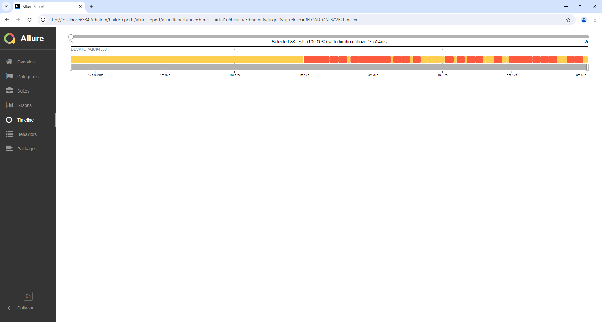
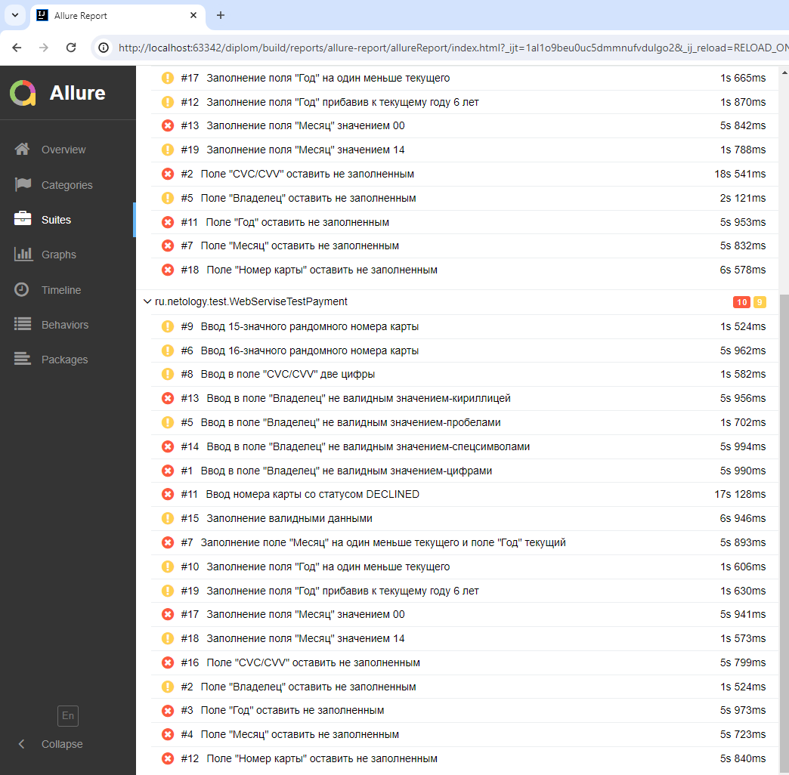

                                                    Количество тест-кейсов

Выполнено 38 автоматизированных тест-кейсов с СУБД MySQL;

Выполнено 38 автоматизированных тест-кейсов с СУБД PostgreSQL.

                                        Процент успешных и не успешных тест-кейсов

При взаимодействии с СУБД MySQL:

                                      9 успешных тест-кейсов – что составляет 47,36 %;

                                  10 не успешных тест-кейсов – что составляет 52,64 %.

При взаимодействии с СУБД PostgreSQL:

                            9 успешных тест-кейсов – что составляет 47,36 %;

                        10 не успешных тест-кейсов – что составляет 52,64 %.

                                  Общие рекомендации

Приложить техзадание на комплексный сервис с требованиями к дизайну, ограничениям по заполнению полей форм и полей с сообщениями об ошибках, к формированию полей таблиц БД;

Скорректировать название курорта на правильное - Марракеш;

Добавить селекторы для тестирования (типа: data-test-id);

Устарнить баги и провести повторне тестирование.

